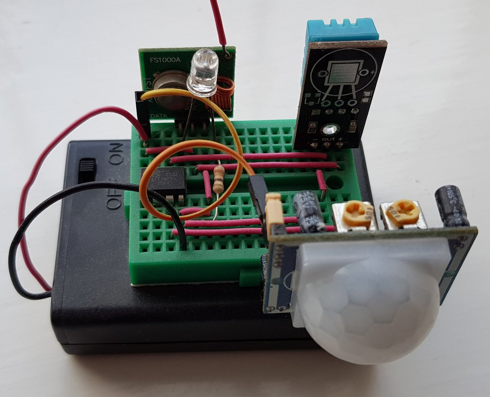

# ATTiny85 temperature/humidity/motion 433MHz node

A battery powered (3 AA batteries) sensor node that detects motion via PIR, sending a signal via a 433MHz transmitter using OOK. In the absence of motion, the node gives periodic reports of temperature, relative humidity (via a DHT-11) and battery voltage. Transmission is uni-directional, so you need a reliable receiver for effective use but the range is sufficient to span a brick house using a half-wavelength antenna on the receiver.

## Getting Started

Components: ATTiny85, HC-SR501 PIR Sensor, DHT-11, led (optional), a 433MHz transmitter.

### Battery life

The tricky parts for this sort of set up are (i) battery life and (ii) false triggering the PIR sensor via the 433MHz transmitter. For (i) we try to put the ATTiny into as low a power state as possible, only using interrupts and the watch dog timer for wakeup. For (ii) we explicitly disable the PIR interrupt when transmitting.

### Prerequisites

You need an ISP to program the ATTiny85. You can use an existing Arduino as an ISP; see [here](https://create.arduino.cc/projecthub/arjun/programming-attiny85-with-arduino-uno-afb829).

### In use

If the PIR detects motion a signal is sent via the 433MHz transmitter. If there is no PIR triggering for a set period of time then a "no motion" signal is sent via the transmitter. The trigger timer of the PIR sensor is not used. The voltage regulator of the PIR is by-passed to save battery life (easy to do with a SR501).

If no activity is detected, then the node periodically reports temperature, humidity and voltage via the transmitter.

For best use, I suggest that your 433MHz receiver converts everything to MQTT, which is particularly useful for integration into Home Assistant. In my test case, the motion sensors trigger Lifx lighting in each location via the 433MHz receiver to MQTT bridge.

### RF format

I already have a ["HomeEasy"](https://github.com/bruce33/homeeasyhacking) protocol receiver, built via an Arduino Nano with a superheterodyne 433MHz receiver. I hi-jack the same protocol here to transmit the motion/temperature/humidity/voltage.

